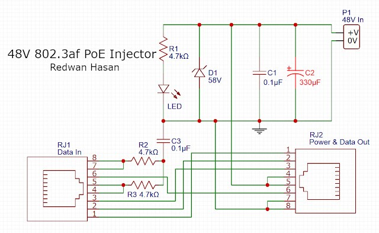
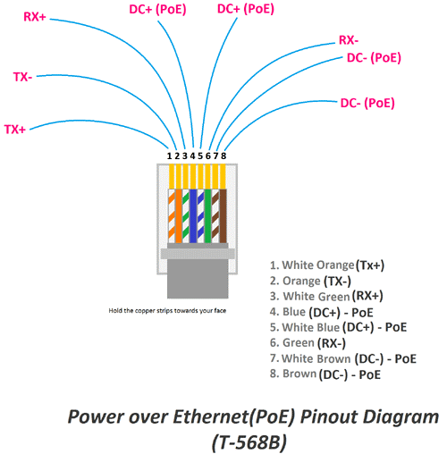
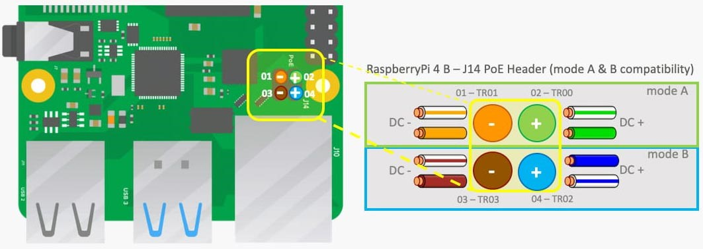
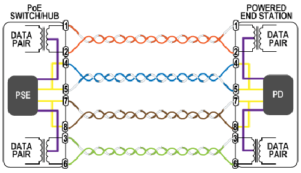

# LAN CAble Configuration and POE switch Connection
**Purpose:**

Purpose of this document is to know about the Ethernet cable connction and PoE injection.

### RJ45 Pinout Ethernet Cables (Cat 5e, 6 & 7)

Ethernet LAN cables can come in two types – Crossover or Straight through. Most modern communications equipment can auto-sense which 
type you are using, but some still need the correct cable pinout. The following are the pinouts for the RJ45 connectors so you can 
check which one you have or make up your own. It doesn’t matter if you make up some Cat5e, Cat6, and Cat7 cables. The pinout is always 
the same for Ethernet cables.

### Straight Through LAN Cable Pinout

Straight through LAN cables are the most common, and the pinout is the same if they are Cat5e, Cat6, or Cat 7. The different types of
 cables (category or cat) offer increasingly faster transmit and receive speeds. This is achieved by increasing the wire twists, 
better shielding, drain wire, and increased diameter.

There are two different pinout standards used worldwide, and depending on your location, you will determine which one you should use.
An easy way to remember the two different RJ45 connector pinouts is T568A is used in America and Asia, and T568B is used in Britain(UK) and Europe. 
The different pinouts will still work if you mix them up.
* T-568A – Most commonly used in the USA and Asia – Think A for America
* T-568B – Britain (UK) and Europe

{image1}
Ethernet Cable Pinout T568A and T568B

### RJ45 Pinout for a LAN Cable
| Pin Number | Colour of the Cable | Function |
| --- | --- | --- |
| Pin 1 | → White/Green | Transmit + ( Tx + ) |
| Pin 2 | → Green | Transmit - ( Tx - )|
| Pin 3 | → White/Orange | Receive + ( Rx + ) |
| Pin 4 | → Blue | +VDC |
| Pin 5 | → White/Blue | +VDC |
| Pin 6 | → Orange | Receive - ( Rx - )|
| Pin 7 | → White/Brown | -VDC/GND |
| Pin 8 | → Brown | -VDC/GND |

### RJ45 Ethernet Cable Pinout
Remember that Pin 1 is on the left hand side of the RJ45 connector with the clip at the rear.
Crossover Ethernet Cable
Crossover Ethernet cables are used to connect two devices of the same type, for example, if you want to connect two routers or two PCs.
 Most modern IT equipment can auto-detect that a crossover needs to be made and change the signal. This is called MDI-X. 
A crossover LAN cable will connect the receive at one end to the transmit at the other. Care must be taken to clearly identify a 
crossover cable so it is not used by mistake, which may cause network outages. These cables are sometimes made with a cable that has a red outer sheath.

## DIY PoE Injector project
PoE or Power over Ethernet is simply a way to put Power and Data on the same Twisted Pair Network Cable (E.g. CAT6) so that external power source is not required. This is extremely handy when Cameras and Wireless AP are scattered over a place and difficult to run another power cable to them. To use PoE both device has to be PoE capable but what if you have a PoE supported Camera or AP but not a PoE supported Switch? You can simply use a PoE injector or make one yourself. Now this is not going to be as good as a well made say Maxim chip based PoE injector but it should get the job done.

**Components List:**

|NO | Component | Quantity |
|---|---|---|
| 1 | 4.7kΩ 1/4W Resistors | 3Nos |
| 2 | 0.1µF Capacitor | 2Nos |
| 3 | 330µF 100V Electrolytic Capacitor |	1No |
| 4 | Green LED as indicator | 1No |
| 5 | 58V Zener Diode | 1No |
| 6 | RJ45 Female Jack | 2Nos |
| 7 | 48V DC Power Source | 1No |

**Use:**
This can be used for your DIY projects where 12/36/48V PoE is required on 10/100M connection.

**Diagram:**

 
### Description:
This simply puts 48V on the unused pins of Ethernet cable, works on 802.3af 10/100 Mode B. If your source can provide about 400-500mA on 48V you should be able to get about 15W of DC power on the other end which is enough for running a camera or a Wireless AP.

>>**Note:**
Be very careful with polarity.

### Ethernet Cable Pinout
Since we are working with LAN cables for PoE, it is important to know about the functionalities of the different wire pairs that we will find inside an Ethernet cable. The below image shows the Ethernet cable pinout that is currently available on the market.

 

PoE switches may deliver power in three ways: PoE Mode A, PoE Mode B, and 4-pair PoE. Power and data are transmitted concurrently 
across pins 1, 2, 3, and 6 in PoE Mode A. Power is pumped onto pins 4, 5, 7, and 8 in PoE Mode B. In addition, 4-pair PoE distributes 
power to all 8 pins at the same time. PoE Mode A, PoE Mode B, and 4-pair PoE are all supported by active PoE switches, but passive PoE 
switches only support PoE Mode B.

We are making PoE ModeB for our Raspberry Pi 3B+, the below image shows the PoE pins on Raspberry Pi.

 
### Building a POE Injector for Raspberry Pi
A PoE injector, in particular, may be used to connect a network switch to a wireless access point, IP phone, network camera, or any 
other IEEE 802.3af/at-powered device (PD). A PoE-enabled network device is connected to a non-PoE LAN switch port with a PoE injector.
Basically, PoE injector has 2 inputs, one is for DC power and the other is Ethernet port. We will be making our own passive PoE injector that will inject or add a potential difference of DC 12V in the LAN cable using a 12V power adaptor. Now let's talk about the connections.

 
Because the connections are straightforward, we must determine which pair of wires is available for power transmission and which pair is responsible for data. 
Here in the above image, you can see that pair 4-5 and pair 7-8 are responsible for the power transmission and the remaining 1-2 and 3-6 are for data transmission. So now let’s look at the circuit, we have used to build our PoE injector.